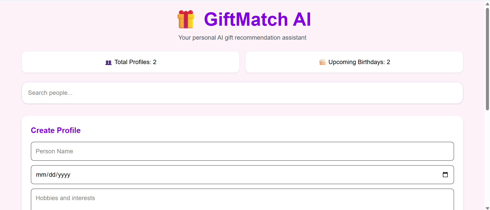
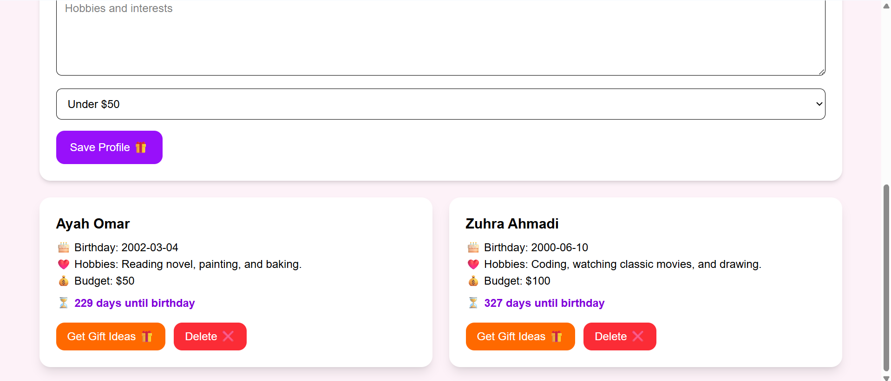

# 🎁 GiftMatch AI

GiftMatch AI is an AI-powered gift recommendation platform that help users organize information about friends and family while generating personalized gift ideas based on hobbies, interests, and budget.

## 🌟 Live Demo

https://giftmatch-ai.netlify.app/

## 📌 Project Overview

Choosing meaningful gifts can be difficult. GiftMatch AI helps users store birthdays and interests in one place and uses AI to generate thoughtful gift suggestions tailored to each person.

## 🚀 Features

- Add friend and family profiles
- Save profiles using LocalStorage
- Search profiles by name
- Sort profiles by upcoming birthdays
- Birthday countdown
- Generate AI-powered gift ideas
- Budget-based gift recommendations
- Copy gift ideas to clipboard
- Regenerate gift suggestions
- Responsive mobile-friendly design
- Loading and empty states

## 🛠 Technologies Used

- React
- Vite
- Tailwind CSS
- JavaScript
- LocalStorage
- OpenRouter API
- Cloudflare Workers
- Netlify

## 📷 Screenshots

### Dashboard




### Profile Cards


### AI Gift Suggestions


### Mobile View


## ⚙️ Installation

Clone the repository

```bash
git clone https://github.com/marwaqadeer/giftmatch-ai.git
```

Navigate to the project:

```bash
cd giftmatch-ai
```

Install dependencies:

```bash
npm install
```

Start development server:

```bash
npm run dev
```

## 🎯 Future Improvements

- Amazon gift links
- Gift purchase tracker
- Email birthday reminders
- More advanced AI recommendations

## 📝 Reflection

Building GiftMatch AI helped me combine React, LocalStorage, AI integration, and responsive web design into one complete project. One challenge I faced was calculating upcoming birthdays correctly. I solved this by creating logic that compares the current date with each person's birthday and automatically determines the next upcoming birthday, even if the birthday has already passed in the current year.

Another challenge was integrating AI-generated gift recommendations and handling loading states while waiting for responses. I improved the user experience by adding a loading spinner, copy button, budget selector, and regenerate feature.

Better prompts can improve gift suggestions by providing more context about a person's interests, preferences, and budget. More detailed prompts help the AI generate more personalized and meaningful recommendations.

This project strengthened my skills in React, state management, LocalStorage, API integration, Git, GitHub, and deployment with Netlify.

## 👩‍💻 Author

Marwa Qadeer

CodeWeekend Web & AI Bootcamp 2026
