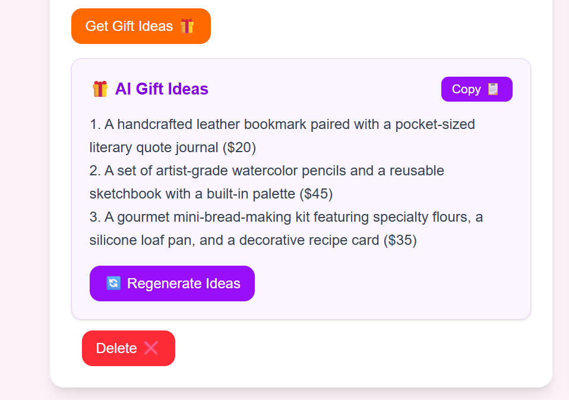
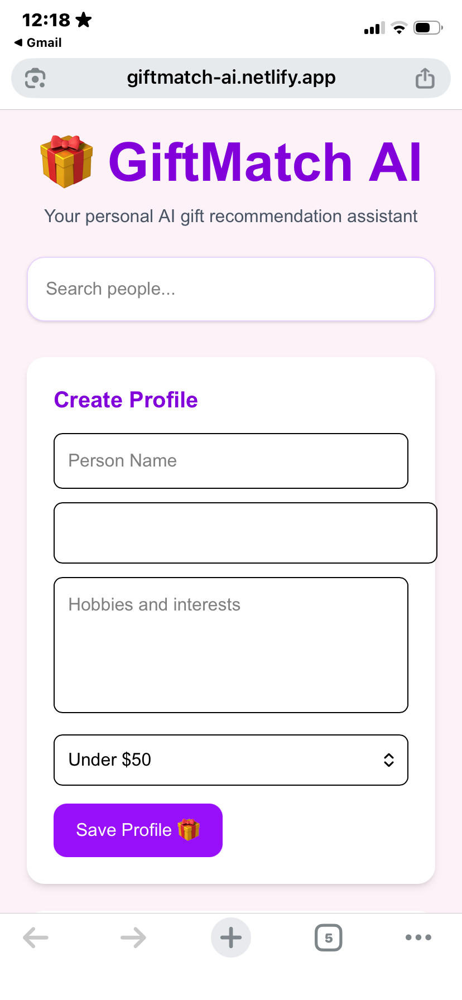
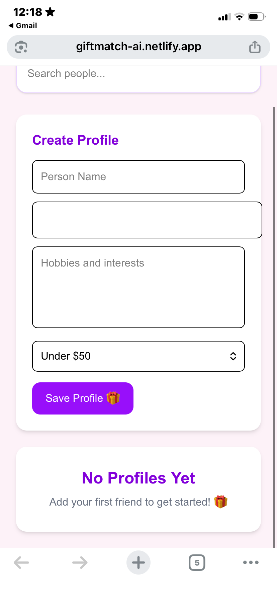

# 🎁 GiftMatch AI

GiftMatch AI is an AI-powered gift recommendation platform that help users organize information about friends and family while generating personalized gift ideas based on hobbies, interests, and budget.

## 🌟 Live Demo

https://giftmatch-ai.netlify.app/

## 📌 Project Overview

Choosing meaningful gifts can be difficult. GiftMatch AI helps users store birthdays and interests in one place and uses AI to generate thoughtful gift suggestions tailored to each person.

## 🚀 Features

- Add friend and family profiles
- Save profiles using LocalStorage
- Search profiles by name
- Sort profiles by upcoming birthdays
- Birthday countdown
- Generate AI-powered gift ideas
- Budget-based gift recommendations
- Copy gift ideas to clipboard
- Regenerate gift suggestions
- Responsive mobile-friendly design
- Loading and empty states

## 🛠 Technologies Used

- React
- Vite
- Tailwind CSS
- JavaScript
- LocalStorage
- OpenRouter API
- Cloudflare Workers
- Netlify

## 📷 Screenshots

### Dashboard


### AI Gift Suggestion

### Profile Cards


### AI Gift Suggestions



### Mobile View




## ⚙️ Installation

Clone the repository

```bash
git clone https://github.com/marwaqadeer/giftmatch-ai.git
```

Navigate to the project:

```bash
cd giftmatch-ai
```

Install dependencies:

```bash
npm install
```

Start development server:

```bash
npm run dev
```

## 🎯 Future Improvements

- Amazon gift links
- Gift purchase tracker
- Email birthday reminders
- More advanced AI recommendations

## 👩‍💻 Author

Marwa Qadeer

CodeWeekend Web & AI Bootcamp 2026
